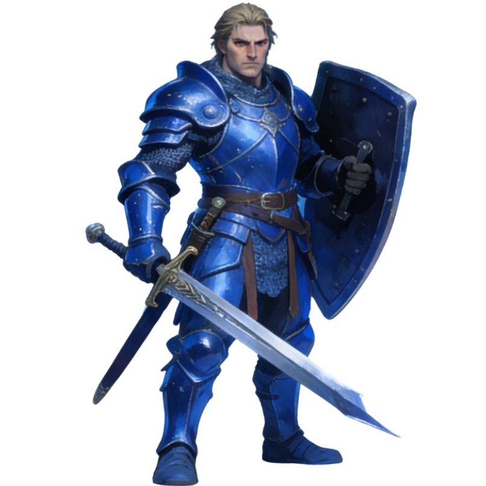
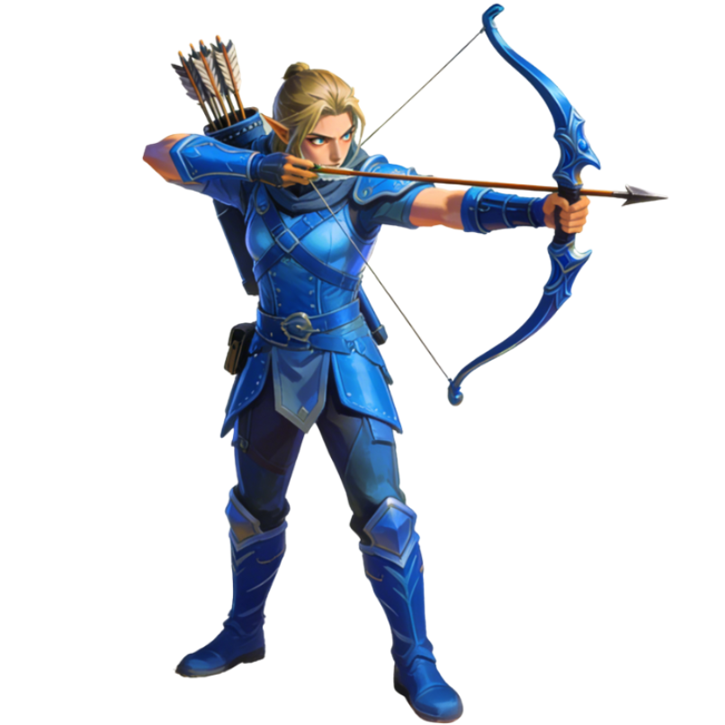
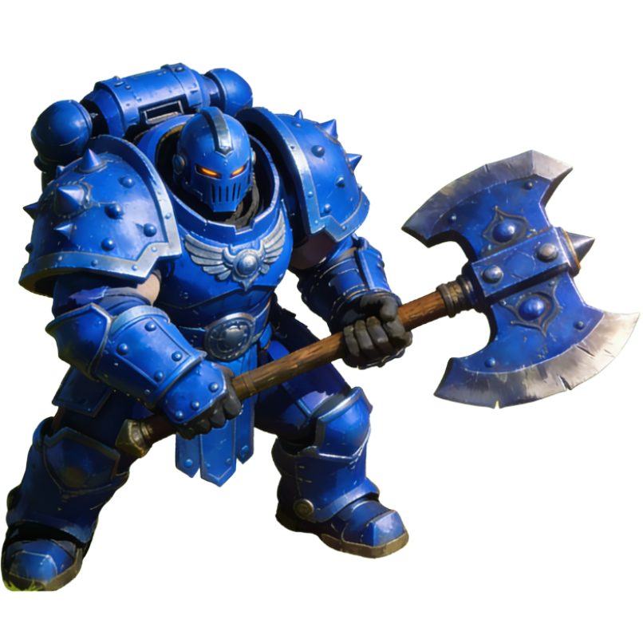
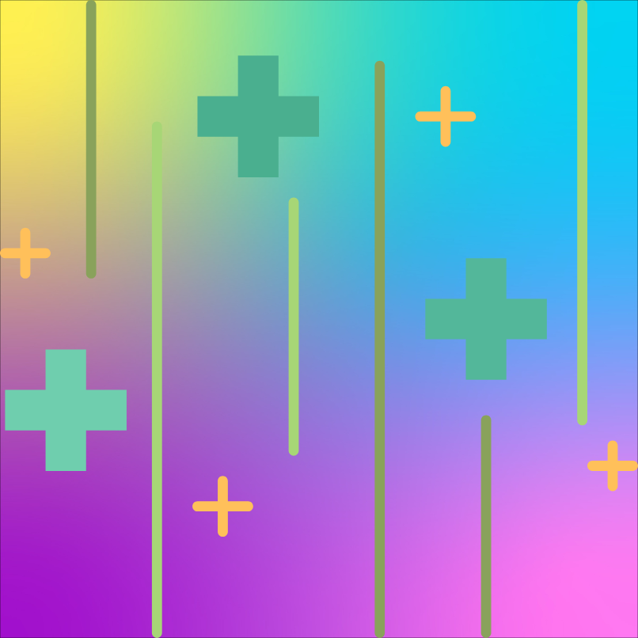
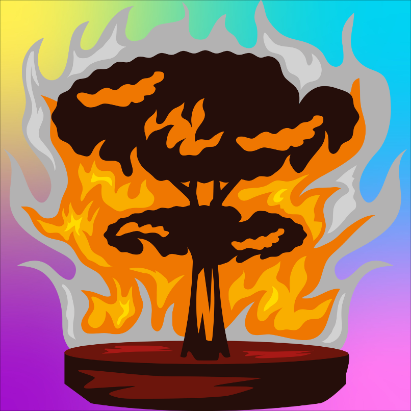

# Let's Battle!!! ⚔️

> 一个基于 C++ 和 SFML 的高性能实时战略 (RTS) 游戏引擎。
> **数据结构课程大作业**

  

## 🎮 游戏简介 (Introduction)

**Let's Battle!!!** 是一款快节奏的实时战棋对战游戏。玩家需要在红蓝对抗中，通过合理的资源管理（能量）、兵种搭配和战术指挥来击败对手。

本项目采用 **MVC 架构** 设计，结合 **多线程技术** 实现了逻辑与渲染的分离，确保了在大量单位同屏和复杂 **A* 寻路** 计算下的流畅体验。地图采用 **DFS 算法过程化生成**，每一次对局都是全新的体验。

### ✨ 核心特性 (Features)

*   **🗺️ 过程化地图生成**: 使用 DFS（深度优先搜索）+ 循环编织算法生成的随机迷宫，包含山脉、河流等多样的地形要素。
*   **🧠 智能 AI 系统**:
    *   **A* 寻路**: 经过 Token 标记法和静态数组优化的 A* 算法，实现毫秒级的高效寻路，支持动态避障。
    *   **FSM 状态机**: 每个单位拥有独立思考能力，自动在待机、追击、攻击、攻城等状态间切换。
*   **⚔️ 丰富的战斗系统**:
    *   3 种特色兵种：**战士** (均衡)、**射手** (远程/高伤)、**坦克** (肉盾)。
    *   全局技能：**治疗光环** (AOE回复) 与 **天降正义** (AOE伤害)。
    *   粒子特效：攻击、技能释放均带有动态视觉反馈 (箭矢飞行、爆炸、斩击)。
*   **⚙️ 强大的游戏控制**:
    *   支持 **0.5x - 4x** 变速功能，方便调试或快进战斗。
    *   完整的能量恢复与消耗机制。
    *   支持鼠标左键点选/生成，右键发布移动指令。

---

## 🎨 游戏素材与角色展示 (Assets Showcase)

本项目包含手绘风格的游戏素材，以下是游戏中的核心单位与技能图标展示。

### 🛡️ 三大兵种 (Units)

| 战士 (Warrior) | 射手 (Archer) | 坦克 (Tank) |
| :---: | :---: | :---: |
|  |  |  |
| **均衡型**<br>移动与攻击平衡<br>前排主力 | **远程型**<br>射程远但血量低<br>后排输出核心 | **肉盾型**<br>高血量高护甲<br>推进战线必备 |

### 🔮 技能与环境 (Skills & Environment)

| 治疗光环 (Heal) | 天降正义 (Damage) | 复杂地形 (Terrain) |
| :---: | :---: | :---: |
|  |  |  |
| *群体回复技能*<br>消耗: 6 能量 | *群体伤害技能*<br>消耗: 6 能量 | *不可穿越的山脉*<br>甚至还有河流 |

### 🚩 胜利画面

| 获胜 (Victory) | 战败 (Defeat) |
| :---: | :---: |
|  |  |


---

## 🛠️ 技术架构 (Tech Stack)

本项目展示了现代 C++ 在游戏开发中的综合应用：

*   **开发环境**: VS Code + MinGW-w64 (g++)
*   **核心语言**: C++17 (使用了 `std::thread`, `std::mutex`, `std::atomic` 等并发特性)
*   **图形库**: [SFML](https://www.sfml-dev.org/) (Simple and Fast Multimedia Library)
*   **架构模式**:
    *   **MVC**: Model（逻辑运算）、View（SFML 绘图）、Controller（输入处理）严格分离，代码高内聚低耦合。
    *   **多线程 (Multi-threading)**:
        *   `Main Thread`: 负责 60FPS 的渲染循环与窗口事件响应。
        *   `Logic Thread`: 负责 30FPS 的物理模拟、AI 思考与状态更新。
    *   **核心算法**: DFS 迷宫生成, A* 寻路 (Manhattan Distance Heuristic).

---

## 🕹️ 操作说明 (Controls)

| 按键/操作 | 功能描述 |
| :--- | :--- |
| **鼠标左键 (底部UI)** | 1. 点击兵种图标生成单位<br>2. 点击技能图标预备释放<br>3. 点击倍速按钮(0.5x~4x) |
| **鼠标左键 (战场)** | 1. 选中我方单位 (Blue Faction)<br>2. 释放当前选中的技能 |
| **鼠标右键** | 命令选中的单位移动到指定位置 (触发手动控制模式) |

---

## 🚀 快速开始 (Getting Started)

### 环境依赖
1.  确保已安装 C++ 编译器 (如 g++ 8.0+).
2.  下载并配置 [SFML](https://www.sfml-dev.org/download.php) 开发库 (Headers & Libs).

### 编译与运行
如果你使用 VS Code 并且配置好了 `c_cpp_properties.json` 和 `tasks.json`，直接按 **F5** 即可运行。

或者使用命令行编译 (以 MinGW 为例):

```bash
# 1. 编译 (注意替换你的 SFML 路径)
g++ -c Game.cpp -I"C:/SFML/include"

# 2. 链接
g++ Game.o -o BattleGame -L"C:/SFML/lib" -lsfml-graphics -lsfml-window -lsfml-system

# 3. 运行
./BattleGame
```

### 资源文件说明
请确保 `assets/` 文件夹位于可执行文件同一目录下，并包含以下资源文件（程序启动时会加载）：
*   `warrior_blue.png`, `warrior_red.png` ...
*   `ground.png`, `mountain.png` ...
*   `arial.ttf` (字体文件，默认读取系统路径 `C:/Windows/Fonts/arial.ttf`)

---

## 👨‍💻 作者

**mygqdmmss**
*   Data Structure Course Project (C++ & SFML)

## 📄 许可证

本项目供学习与交流使用。
